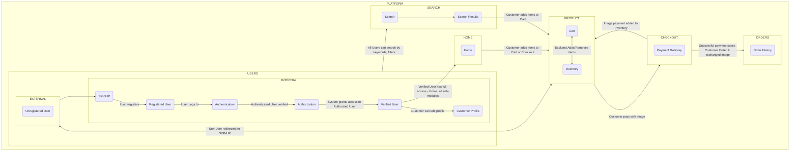

# Database Schema
- Database (SQLite) is implemented as an in-built version for Django
- Django Models are defined using the framework (`models.py`) for each of the apps defined (`users`, `photostore`)  to emulate tables similar to SQL
- After defining the required models the changes are updated through 'Migrations', which translate the instructions in `models.py` to the database to create/update tables
- Database schema (below) defines the logical flow of data through the application backend

 

# Workflow

 

> [Back To README](/README.md) | [Back To ADD-ONS](/ADD-ONS.md)