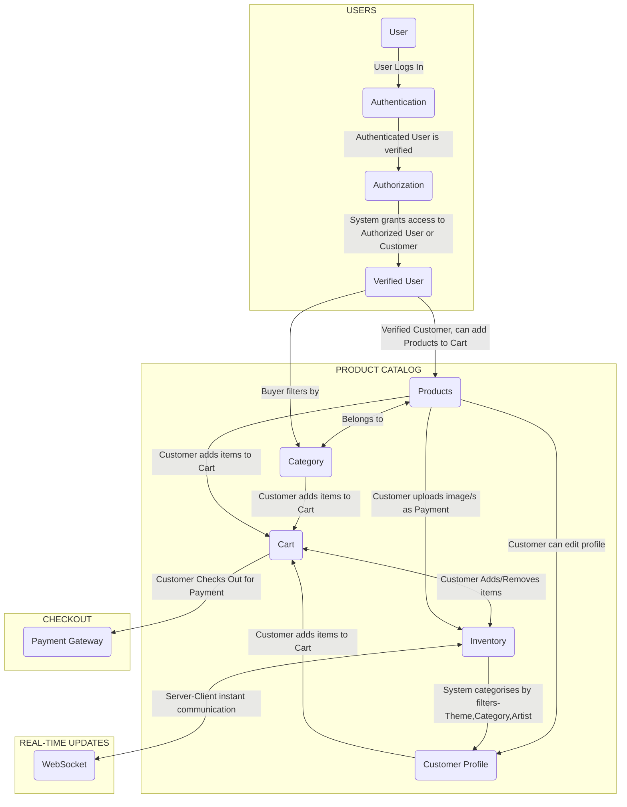

<h1 align="center"> Ecommerce Photo Store - 🎨 <i>PG's Pixies</i> 📸 </h1>

 

# Contents
- [Background](#background)
- [Project Schematic](#project-schematic)
- [Tools](#tools)
- [Implementation](#implementation)
- [Topics Covered](#topics-covered)
- [Resources](#resources)
- [Credits](#credits)

 

# Background
The aim of the project is to build a functional E-commerce platform without a payment gateway. The tech stack I will be using are mentioned in [Tools](#tools). The project being a skills demonstration for Full-Stack Development will have  browsing functionality and a barter-exchange checkout.

The E-commmerce platform I have chosen to develop will be a Photo Store like ShutterStock, Pexels, FreePik, etc. Images advertised on the platform will be loaned. The website consists of :
- Images theme on the platform is *Nature*
- Art from *Bing Image Creator*
- Photos from *Pexels*
- Users or Customers can be Photographers, Artists or Enthusiasts.

 

A fully functional website allows the following functions to be performed :
- Authorize and authenticate Users(Customers) based on their credentials
- Customers can :
  - create their own profiles
  - Browse *Products* and add items to the *Cart*
  - Search *Products* through filters - *Category, Inventory, Artist Profile* 
  - Upload photographs and art to the *Product Inventory* as Payment
- *Real-Time Updates* updates inventory items based on the checked-out items

 

# Project Schematic

- **USERS**
  - This section includes User Authentication & Authorization
  - System(database and Backend) authenticates and authorizes User based on their credentials, i.e., Buyer/Seller.
  - Seller, such as Photographers/Artists can upload photos/art, 
  - Buyer, such as Customers can view profiles of photographers, products and proceed to **CHECKOUT**

- **PRODUCT CATALOG**
  - This section includes Products, Categories, Artists' Profiles, Cart, and Inventory. 
  - *Products*
    - Verified Users proceed to different areas from here
    - Buyer can access - *Artists' Profiles, Cart, Inventory*
  - *Categories*
    - Verified Users as Buyer can directly access - *Categories*
    - Contains grouped *Products*
  - *Cart*
    - Buyer can add/remove items 
    - Satisfied Buyer access *Checkout* to purchase the added products
  - *Inventory*
    - Buyer can access, to add/remove items to/from *Cart*
    - Groups and Categories items by Artist to assign items to Artists' Profiles
    - *Cart* items trigger *Inventory* updates through *Real-Time Updates*

- **CHECKOUT**
  - Verified User adds items to Cart and proceeds to checkout for payment

- **REAL-TIME UPDATES**
  - Real-time updates via WebSockets enable real-time interactions, including updating the cart and inventory.

 

# Tools
- **Frontend**
  - Figma (for design)
  - HTML
  - CSS 
  - JS

- **Database**
  - SQLite

- **Backend**
  - Django (Python)

 

# Implementation
## **Week 0: Project Design**
- [X] Week 0: Define project directories and files
- [X] Week 0: Use Figma to build ecommerce store design

## **Week 1: Project Setup and HTML/CSS**
- [X] Project Setup: Create a Django project.
- [X] HTML/CSS: Review and strengthen HTML and CSS skills.
- Resources: Online HTML/CSS tutorials, Django documentation.

## **Week 2: Django Fundamentals**
- [X] Django Basics: Learn about Django's project structure, settings, and apps.
- [X] Models: Create Django models for products and categories.
- Resources: Official Django documentation, Django for Beginners book.

## **Week 3: Django Views and Templates**
- [X] Views: Create views to render product listings and detail pages.
- [X] Templates: Build HTML templates for product pages.
- Resources: Django documentation on views and templates.

## **Week 4: User Authentication**
- [X] User Authentication: Implement user registration and login functionality.
- [X] Custom User Model: Create a custom user model with additional fields.
- Resources: Django authentication documentation, Django for Beginners book.

## **Week 8: Real-time Updates (WebSockets)**
- [ ] WebSocket Basics: Understand WebSocket communication.
- [ ] Implement Real-Time: Add real-time features like instant cart updates.
- Resources: WebSockets tutorials, Django Channels documentation.

## OPTIONAL
**Week 5: JavaScript Basics**
- [ ] JavaScript Fundamentals: Start learning JavaScript from scratch (Vanilla JS).
- [ ] Interactive Features: Enhance your product pages with basic interactivity.
- Resources: MDN JavaScript guide, JavaScript.info, freeCodeCamp's JavaScript curriculum.

**Week 6: Frontend Interactivity with JavaScript**
- [ ] Dynamic Content: Use JavaScript to load products dynamically.
- [ ] Event Handling: Implement user interactions like adding products to the cart.
- Resources: JavaScript tutorials, interactive coding platforms like CodePen.

**Week 7: Django REST Framework**
- [ ] API Development: Learn to build RESTful APIs with Django REST Framework.
- [ ] API Endpoints: Create API endpoints for product data.
- Resources: Django REST Framework documentation, DRF tutorials.

**Week 9: User Authorization and Permissions**
- [ ] Authorization: Implement user roles (e.g., admin, customer).
- [ ] Permission Control: Set up authorization for views and API endpoints.
- Resources: Django authorization documentation.

**Week 10: Database Optimization and Transactions**
- [ ] SQL Skills: Deepen your SQL knowledge for database queries.
- [ ] Transactions: Learn about database transactions and ACID properties.
- [ ] Database Optimization: Optimize database queries for performance.
- Resources: SQL tutorials, SQL optimization guides.

**Week 11: Advanced JavaScript**
- [ ] Advanced JavaScript Concepts: Dive deeper into JavaScript, including DOM manipulation.
- [ ] Implement Complex Features: Enhance user experience with advanced JS features.
- Resources: Advanced JavaScript courses, MDN web APIs.

**Week 12: Final Testing and Deployment**
- [ ] Testing: Write unit and integration tests for your application.
- [ ] Deployment: Deploy your Django application to a hosting platform (e.g., Heroku).
- Resources: Django testing documentation, deployment guides.

 

# Topics Covered

<b>Frontend Development</b>

1. **HTML/CSS Fundamentals:**
   - Review and strengthen your HTML and CSS skills.

2. **JavaScript Basics:**
   - Learn JavaScript fundamentals (Vanilla JS).
   - Enhance product pages with basic interactivity.

3. **Frontend Interactivity:**
   - Use JavaScript to load products dynamically.
   - Implement user interactions like adding products to the cart.

4. **Django Templating:**
   - Build HTML templates for product pages using Django's template engine.
   - Serve static files (CSS, JS) in Django.

<b>Backend Development with Django</b>

1. **Django Basics:**
   - Understand Django's project structure, settings, and apps.

2. **User Authentication:**
   - Implement user registration and login functionality.
   - Create a custom user model with additional fields.

3. **Django Views and API Development:**
   - Create views to render product listings and detail pages.
   - Set up authorization for views and API endpoints.

4. **Real-time Updates (WebSockets):**
   - Implement real-time features like instant cart updates.
   
5. **Advanced JavaScript Integration:**
   - Dive deeper into JavaScript for frontend enhancements.
   
6. **Testing and Deployment:**
   - Write unit and integration tests for your application.
   - Deploy your Django application to a hosting platform (e.g., Heroku).

<b>Database Integration with SQLite</b>

1. **Database Design:**
   - Create Django models for products and categories.

2. **Django REST Framework:**
   - Build RESTful APIs with Django REST Framework.
   - Create API endpoints for product data.

3. **Database Optimization and Transactions:**
   - Deepen SQL knowledge for database queries.
   - Learn about database transactions and ([ACID properties](https://www.geeksforgeeks.org/acid-properties-in-dbms/)).
   - Optimize database queries for performance.

 

# Resources
- Django
  - [Official Django Documentation](https://docs.djangoproject.com/)
  - [CS50-Web Programming](https://cs50.harvard.edu/web/2020/weeks/3/)
  - [MDN Django Web Framework (Mozilla Developer Network)](https://developer.mozilla.org/en-US/docs/Learn/Server-side/Django)

- SQLite
  - [Official SQLite Documentation](https://www.sqlite.org/docs.html)

- [JavaScript - freeCodeCamp](https://www.freecodecamp.org/learn/javascript-algorithms-and-data-structures/)

 

# Credits
- **Plan built in collaboration with ChatGPT (GPT-3.5)**
