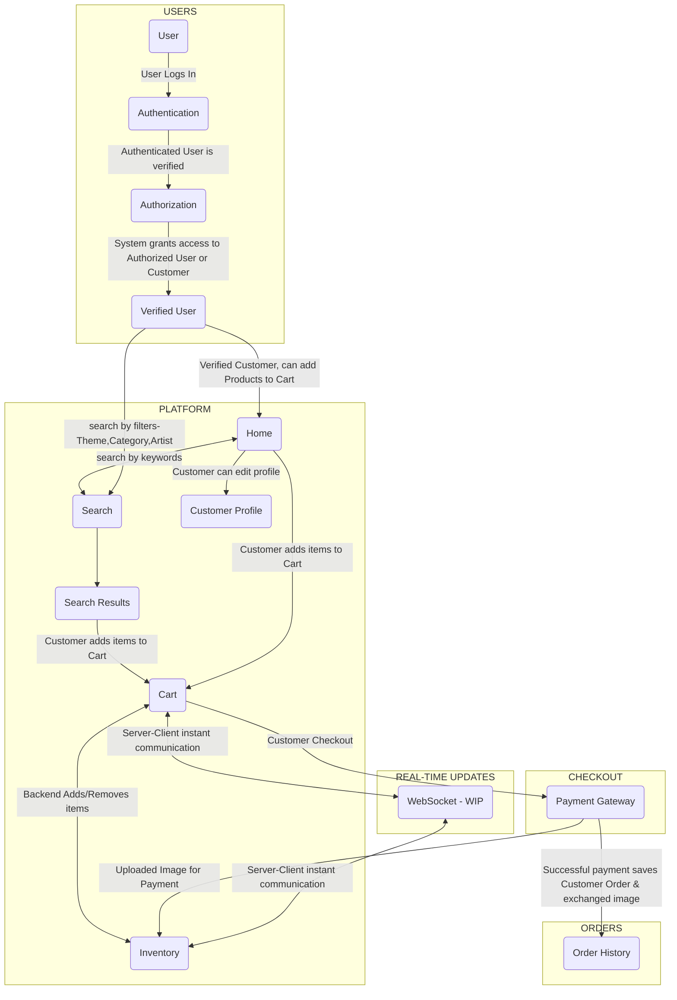

<h1 align="center"> Ecommerce Photo Store - 🎨 <i>PG's Picsies</i> 📸 </h1>

# Contents
- [Project Setup](#project-setup)
- [Background](#background)
- [Project Overview](#project-overview)
- [Tools](#tools)
- [Resources](#resources)
- [Credits](#credits)

 

# Project Setup
- Please refer to the [Guidebook](GUIDE.md) for steps to setup the development environment and execute the project.

# Background
The aim of the project is to build a functional E-commerce platform with a built-in payment gateway. For tech stack check [Tools](#tools). The platform being a skills demonstration for Full-Stack Development will have browsing functionality and a barter-exchange checkout.

**PG's Picsies** is a Photo store similar to ShutterStock, Pexels, FreePik, etc. Images advertised on the platform will be loaned (check [Credits](#credits)). The website consists of :
- Images themed on the platform is *Nature*
- Art from *Bing Copilot Designer*
- Photos from *Pexels*
- Users or Customers can be Photographers, Artists or Enthusiasts.

 

In brief, currently the application is capable of performing the following functions:
- Authorize and authenticate Users(Customers) based on their credentials
- Users/Customers can :
  - Register and create their own profiles
  - Browse *Products* and add items to the *Cart*
  - Search *Products* through filters - *Type, Theme & Author*
  - Edit their *Cart* - increase/decrease product quantity, remove product
  - Upload photographs and/or art to the *Product Inventory* as Payment

 

The application is fully-functional on a fundamental level (check [Walk-through](#walk-through))
 
The application will be updated at every chance available, for advanced functionality (check [Features in progress](#features-in-progress))
 

# Project Overview

Jump to either of the sections below for a project glimpse.

[Workflow](#workflow) | [Walkthrough](#walkthrough) | [Database Schema](#database-schema) | [Features Implemented](#features-implemented) | [Features In Progress](#features-in-progress)

## Workflow

[Back To Main](#project-overview)

## Walk-through
<blockquote><i>Demo video</i></blockquote>

*...production in progress...*

### User Login/Sign Up
  - Login/Signup includes User Authentication & Authorization
  - System(database and Backend) authenticates and authorizes User based on their credentials
  - Upon successful authentication, Users/Customers can 
    - View or edit their profiles, 
    - Browse or search for products and
    - Proceed to [**Checkout**](#checkout) to barter an image in exchange for the images they would like to own
- **User *login* page**

- **User *registration* page** ( logo and text remain the same for sign up page as well )

### Home 
  - Customers once authenticated will be welcomed with their name
  - Home page consists of :
    - 'Photo' & 'Art of the Day' images,
    - Images related to 'Theme of the Day'
  - If unauthenticated Users access the **Home** page they will be redirected to *Login* upon doing either of the following actions :
    - add image to Cart, Or
    - access [**Checkout**](#checkout)
  - Unauthenticated Users can still :
    - search for images using the Search bar,
    - browse images in 'Products'
<!--

-->
- **Non-User *Home* page**

- **User *Home* page** 

### Products
  - *Images*
    - 'Photo' & 'Art of the Day' images,
    - Authenticated and Unauthenticated Users can access all images using *Search Filters*
    - Only verified Users/Customers can add items to *Cart* and *Checkout* for payment
  - *Search Filters*
    - Authenticated and Unauthenticated Users can filter images by - *Image Theme, Image Type & Artist*
  - *Cart*
    - After authentication, Customer can :
      - add/remove items 
      - access *Checkout* to purchase added products
  - *Inventory*
    - Only Admin has access
    - All Users/Customers information is accessible
    - All images information is accessible
    - All Carted items & Orders are accessible

- **Filter images by Type, Theme and Artist**

### Checkout
  - Displays all items added to *Cart*
  - Provides options to 'Change Quantity' or 'Remove', default quantity is 1
  - Provides options to 'Continue Shopping' or 'Proceed to Payment'
- **Checkout view of verified Customer**

### Payment Gateway
  - Final display of all items added to Cart with quantity
  - Provides options to 'Remove'
  - Explains payment procedure
  - Information about payment is to be filled in the form
  - Upon successful payment, redirects to *Home* page with success message
- **Payment view - payment procedure & items summary**

- **Payment view - payment information**

- **Successful Payment view - order & payment confirmation message**

[Back To Main](#project-overview)

## Database Schema
- Database (SQLite) is implemented as an in-built version for Django
- Django Models are defined using the framework (`models.py`) for each of the apps defined (`users`, `photostore`)  to emulate tables similar to SQL
- After defining the required models the changes are updated through 'Migrations', which translate the instructions in `models.py` to the database to create/update tables
- Database schema (below) defines the logical flow of data through the application backend

[Back To Main](#project-overview)

 

# Tools
- **Frontend**
  - Figma (for design)
  - HTML
  - CSS 

- **Database**
  - SQLite

- **Backend**
  - Django (Python)

 

[Back To Top](#contents)

# Features Implemented
## Project Design
- [X] Define project directories and files
- [X] Use Figma to build ecommerce store design
- Resources: Figma

## Project Setup and HTML/CSS
- [X] Project Setup: Create a Django project.
- [X] HTML/CSS: Review and strengthen HTML and CSS skills.
- Resources: Online HTML/CSS tutorials, Django documentation.

## Django Fundamentals
- [X] Django Basics: Learn about Django's project structure, settings, and apps.
- [X] Models: Create Django models for products and categories.
- Resources: Official Django documentation.

## Django Views and Templates
- [X] Views: Create views to render product listings and detail pages.
- [X] Templates: Build HTML templates for product pages.
- Resources: Django documentation on views and templates.

## User Authentication
- [X] User Authentication: Implement user registration and login functionality.
- [X] Custom User Model: Create a custom user model with additional fields.
- Resources: Django documentation on User authentication.

 

[Back To Main](#project-overview)

 

# Features In Progress
- The following features are updated not neccessarily in sequence.
- Currently learning Javascript, hence would start updating from [Client-side interaction](#client-side-interaction)

## Real-time Updates (WebSockets)
- [ ] WebSocket Basics: Understand WebSocket communication using Django Channels .
- [ ] Implement Real-Time: Add real-time features like instant cart updates.
- Resources: [WebSocket Tutorials](https://www.geeksforgeeks.org/django-channels-introduction-and-basic-setup/), Django Channels documentation.

## User Authorization and Permissions
- [X] Authorization: Implement user roles (e.g., admin, customer).
- [ ] Permission Control: Set up authorization for views and API endpoints.
- Resources: Django authorization documentation.

## Database Optimization and Transactions
- [X] SQL Skills: Deepen your SQL knowledge for database queries.
- [ ] Transactions: Learn about database transactions and ACID properties.
- [ ] Database Optimization: Optimize database queries for performance.
- Resources: SQL tutorials, SQL optimization guides.

## Client-side interaction 
### Fundamental Javascript
- [ ] JavaScript Fundamentals: Start learning JavaScript from scratch (Vanilla JS).
- [ ] Interactive Features: Enhance your product pages with basic interactivity.
- Resources: MDN JavaScript guide, JavaScript.info, freeCodeCamp's JavaScript curriculum.

### Advanced JavaScript
- [ ] Dynamic Content: Use JavaScript to load products dynamically.
- [ ] Event Handling: Implement user interactions like adding products to the cart.
- [ ] Implement Complex Features: Enhance user experience with advanced JS features.
- Resources: freeCodeCamp JavaScript tutorials, MDN web APIs.

## Django REST Framework
- [ ] API Development: Learn to build RESTful APIs with Django REST Framework.
- [ ] API Endpoints: Create API endpoints for product data.
- Resources: Django REST Framework documentation, DRF tutorials.

## Final Testing and Deployment
- [ ] Testing: Write unit and integration tests for your application.
- [ ] Deployment: Deploy your Django application to a hosting platform (e.g., pythonanywhere).
- Resources: Django testing documentation, deployment guides.

 

[Back To Main](#project-overview)

# Resources
- Django
  - [Official Django Documentation](https://docs.djangoproject.com/)
  - [CS50-Web Programming](https://cs50.harvard.edu/web/2020/weeks/3/)
- [MDN Django Web Framework (Mozilla Developer Network)](https://developer.mozilla.org/en-US/docs/Learn/Server-side/Django)

- SQLite
  - [Official SQLite Documentation](https://www.sqlite.org/docs.html)

- [JavaScript - freeCodeCamp](https://www.freecodecamp.org/learn/javascript-algorithms-and-data-structures/)

 

# Credits
- **Planning assistance - ChatGPT (GPT-3.5)**
- **Development assistance - **
- **Photos** - *[Pexels](https://www.pexels.com)*
- **Art** - *Bing Copilot Designer*

 

[Back To Top](#contents)